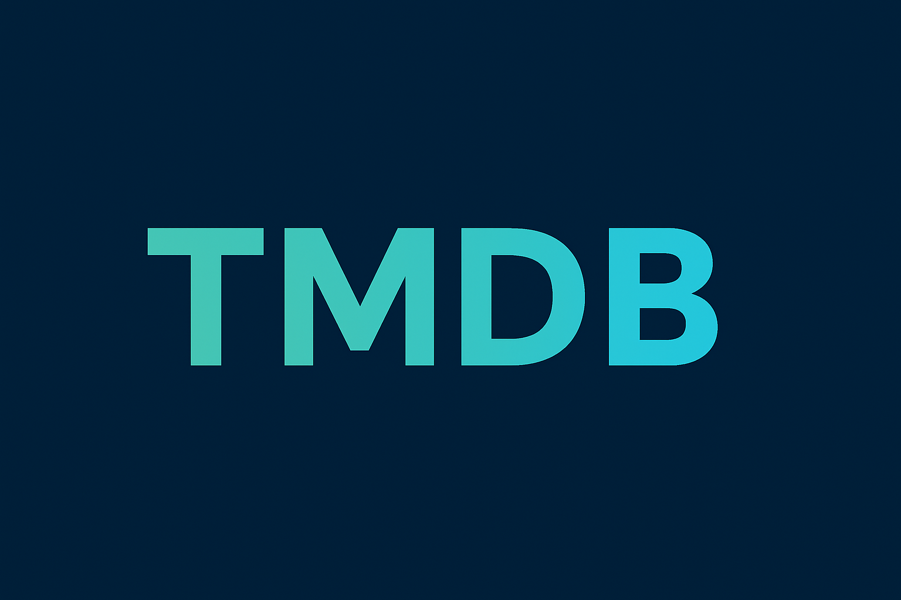

## 🎬 TMDB CLI - Movie Database Command Line Tool

A professional PHP command-line interface for The Movie Database (TMDB) API.


````markdown
## 🚀 Quick Start

```bash
# Get popular movies
php tmdb-app --type popular
# Get now playing movies
php tmdb-app --type playing
# Get top rated movies
php tmdb-app --type top
# Get upcoming movies
php tmdb-app --type upcoming
```
````

## 📦 Installation

```bash
# Clone repository
git clone https://github.com/vasei-me/tmdb-cli.git
cd tmdb-cli
# Install dependencies
composer install
# Configure environment (add your TMDB API key)
echo "TMDB_API_KEY=your_api_key_here" > .env
```

## 🎯 Usage Examples

```bash
## 🎬 TMDB CLI - Movie Database Command Line Tool

A small PHP command-line client for The Movie Database (TMDB) API.

Installation
-------------

1. Clone the repository and install dependencies:

```
git clone https://github.com/vasei-me/tmdb-cli.git
cd tmdb-cli
composer install
```

2. Create a `.env` from the example and add your TMDB API key:

```
copy .env.example .env
# then edit .env and set TMDB_API_KEY
```

Usage
-----

Run the CLI (Windows / macOS / Linux):

```
php tmdb-app --type popular
php tmdb-app --type playing
php tmdb-app --type top
php tmdb-app --type upcoming
```

Pagination:

```
php tmdb-app --type popular --page 2
```

Development / Running without an API key
---------------------------------------

You can run without a TMDB API key by using the mock backend:

```
php tmdb-app --mock --type playing
```

Notes
-----

- Logs are written to `logs/app.log`.
- Cached API responses are stored in the `cache/` directory.

If you want, I can also add a `composer` script to make running easier.
